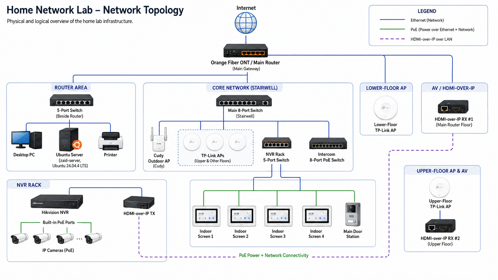

<div align="center">

# Home Network & Linux Infrastructure Lab

**A self-hosted infrastructure lab focused on Linux administration, networking, remote access, application deployment, and self-hosted services.**


</div>

---

## Overview

This repository documents the design, deployment, administration, and ongoing development of my personal **home network and Linux infrastructure lab**.

The environment was built to gain practical hands-on experience beyond coursework in areas such as:

* Linux server administration
* TCP/IP networking
* Physical Ethernet infrastructure
* Static IP planning
* VPN networking
* Remote administration
* Docker containers
* Web application deployment
* Network file sharing
* Media hosting
* Game server hosting
* DNS configuration and troubleshooting
* CCTV and IP-based device integration
* Network troubleshooting

At the center of the lab is an older laptop running **Ubuntu Server 24.04.4 LTS**, which acts as a multi-purpose server for applications, services, storage, remote access, and experimentation.

---

## Network Topology

The home network consists of an Orange Fiber gateway, multiple Ethernet switches, TP-Link access points, an outdoor Cudy access point, an Ubuntu server, CCTV infrastructure, an IP intercom system, and HDMI-over-IP devices distributed across multiple floors.

<p align="center">
  
</p>

### Main Architecture

```text
Internet
   │
   ▼
Orange Fiber ONT / Main Router
   │
   ├── 5-Port Switch
   │     ├── Desktop PC
   │     ├── Ubuntu Server
   │     └── Printer
   │
   ├── Lower-Floor TP-Link Access Point
   │
   ├── HDMI-over-IP RX #1
   │
   └── Main 8-Port Switch
         │
         ├── Cudy Outdoor Access Point
         ├── TP-Link Access Points
         │     └── HDMI-over-IP RX #2
         │
         ├── NVR Rack 5-Port Switch
         │     ├── Hikvision NVR
         │     │     └── IP Cameras via built-in PoE ports
         │     │
         │     └── HDMI-over-IP TX
         │
         └── Intercom 8-Port PoE Switch
               ├── Indoor Screen 1
               ├── Indoor Screen 2
               ├── Indoor Screen 3
               ├── Indoor Screen 4
               └── Main Door Station
```

Important infrastructure devices use **static or reserved IP addresses** to maintain predictable addressing and simplify administration.

---

## Ubuntu Server

The main server runs:

```text
OS:       Ubuntu Server 24.04.4 LTS
Hostname: zaid-server
Release:  24.04
Codename: noble
```

The server acts as the main compute and service-hosting system within the lab.

It is administered primarily through **SSH** and runs multiple services simultaneously.

### Server Responsibilities

* Web application hosting
* Docker workloads
* Remote access
* VPN connectivity
* Plex Media Server
* Network file sharing
* Minecraft server hosting
* Counter-Strike 1.6 server hosting
* Application deployment
* Networking experiments
* DNS testing
* File storage

---

## Linux Administration

The lab provides practical experience administering a Linux server primarily through the command line.

Tasks performed include:

* SSH remote administration
* Package installation and updates
* Linux service management
* Process management
* Network configuration
* Static IP configuration
* File and directory permissions
* File transfers between Windows and Linux
* Network file sharing
* Web server administration
* Docker deployment
* Application deployment
* Log inspection
* Connectivity troubleshooting
* Service troubleshooting

The server is operated without relying on a desktop environment for day-to-day administration.

---

## Remote Access with Tailscale

**Tailscale** is used to create a secure private network between devices outside the home and the Ubuntu server.

This allows services hosted inside the home network to be accessed remotely without directly exposing every service to the public Internet.

The setup is used for:

* Remote SSH administration
* Accessing private services
* Remote application testing
* Game server connectivity
* Accessing the home server from external networks
* Working around limitations with inbound connectivity through the ISP router

The Ubuntu server has also been configured as a **Tailscale Exit Node**.

### Remote Access Flow

```text
Remote Device
     │
     │
     ▼
Tailscale Network
     │
     ▼
Ubuntu Server
     │
     ├── SSH
     ├── Hosted Applications
     ├── Game Servers
     └── Other Private Services
```

---

## Application Deployment

The Ubuntu server is used as a deployment environment for web applications, including my university graduation project.

Technologies used in the deployment environment include:

* Ubuntu Server
* Apache HTTP Server
* Docker
* SSH
* Tailscale
* Linux networking

### Deployment Architecture

```text
Remote Client
     │
     ▼
Tailscale Network
     │
     ▼
Ubuntu Server
     │
     ├── Apache
     │
     └── Docker
           │
           ▼
       Application
```

Using my own infrastructure as the deployment environment provided practical experience with moving an application from development into a remotely accessible hosted environment.

---

## Docker

Docker is used on the Ubuntu server for containerized workloads and application deployment.

This provides hands-on experience with:

* Running containers on Linux
* Managing containerized services
* Application deployment
* Port exposure
* Container networking
* Service isolation
* Remote container administration

Docker is part of the broader self-hosted environment rather than being used only as an isolated lab exercise.

---

## Apache Web Server

**Apache HTTP Server** is used as part of the web application hosting environment.

The server has been configured for hosting and accessing applications running on the Ubuntu machine.

This provided experience with:

* Linux web server configuration
* Application hosting
* Service management
* Network accessibility
* Troubleshooting deployed applications

---

## Network File Sharing

The Ubuntu server also provides **SMB-based network file sharing** to Windows devices on the local network.

Shared directories stored on the Linux server can be accessed directly from Windows File Explorer.

Example:

```text
Windows PC
    │
    │ SMB
    ▼
Ubuntu Server
    │
    └── Shared Directories
```

The setup is used for:

* Transferring files between Windows and Linux
* Centralized file storage
* Accessing server files from desktop systems
* Sharing media across the local network
* Managing permissions for shared directories

This provided practical experience with cross-platform network storage and file access.

---

## Plex Media Server

The Ubuntu server also hosts **Plex Media Server**.

Plex organizes media stored on the server and provides a centralized interface for accessing and streaming it across supported devices.

### Media Architecture

```text
Media Files
    │
    ▼
Ubuntu Server
    │
    ├── Shared Storage
    │
    └── Plex Media Server
              │
              ├── Desktop / Browser
              ├── Mobile Devices
              └── TVs / Other Clients
```

This setup provides experience with:

* Self-hosted media services
* Linux storage
* Client/server architecture
* Network streaming
* Service administration
* Media library management
* Multi-device service access

---

## Minecraft Paper Server

A multiplayer **Minecraft server using Paper** was deployed and administered on Ubuntu Server.

Tasks performed include:

* Installing the required Java runtime
* Deploying the Paper server
* Configuring server properties
* Managing the server through Linux
* Starting and stopping server processes
* Remote administration through SSH
* Configuring remote player connectivity
* Allowing friends to connect remotely
* Troubleshooting networking and server issues

This provided practical experience with hosting a persistent client/server application on Linux.

---

## Counter-Strike 1.6 Dedicated Server

A **Counter-Strike 1.6 dedicated server using HLDS** was also deployed on the Ubuntu server.

The setup involved:

* Linux-based dedicated server deployment
* HLDS configuration
* Server process management
* Port and connectivity testing
* Remote client connectivity
* VPN-based access using Tailscale
* Troubleshooting client/server communication

The server was used by real remote players rather than functioning only as a local test environment.

---

## Pi-hole DNS Lab

**Pi-hole** was installed and tested as a network-wide DNS filtering solution.

The experiment included:

* DNS resolution
* DNS forwarding
* Upstream DNS configuration
* Router DNS behavior
* Client DNS requests
* Network-wide DNS filtering
* DNS troubleshooting

During testing, compatibility and DNS behavior involving the ISP-provided Orange router caused reliability issues.

Instead of leaving an unstable DNS configuration active, the Pi-hole deployment was disabled.

**Current Status:** Disabled / retained as a lab experiment.

This experiment provided practical experience with DNS dependencies, router limitations, troubleshooting, and rollback when an infrastructure change negatively affected network reliability.

---

## Physical Network Infrastructure

The project includes both logical networking and hands-on physical infrastructure work.

I designed and installed significant parts of the Ethernet infrastructure used throughout the home.

Tasks included:

* Planning network topology
* Determining network equipment placement
* Routing Ethernet cables between floors
* Installing Ethernet cabling
* Terminating Ethernet cables
* Crimping RJ45 connectors
* Installing Ethernet switches
* Deploying access points
* Testing physical Ethernet connectivity
* Troubleshooting cable and link issues
* Integrating network devices across multiple floors

This provided practical experience with **Layer 1 infrastructure** in addition to higher-level TCP/IP networking.

---

## Wireless Network Infrastructure

Multiple routers are configured as **access points** rather than independent routed networks.

The wireless infrastructure includes:

* Multiple TP-Link access points
* Cudy outdoor access point
* Lower-floor wireless coverage
* Upper-floor wireless coverage
* Outdoor coverage

Using access-point mode allows devices throughout the property to remain part of the same primary network instead of creating unnecessary independent NAT networks.

---

## CCTV Infrastructure

The home network includes a **Hikvision NVR** and multiple IP cameras.

The NVR is connected to the main LAN through a dedicated switch located inside the NVR rack.

### CCTV Topology

```text
Main 8-Port Switch
       │
       ▼
NVR Rack 5-Port Switch
       │
       ▼
Hikvision NVR
       │
       │ Built-in PoE
       ▼
   IP Cameras
```

The cameras connect directly to the NVR's built-in PoE interfaces, which provide both network connectivity and power.

This setup provided practical experience integrating IP surveillance equipment into a larger network infrastructure.

---

## IP Intercom System

The network also contains an IP-based intercom system connected through a dedicated **8-port PoE switch**.

### Intercom Architecture

```text
Main 8-Port Switch
       │
       ▼
Intercom 8-Port PoE Switch
       │
       ├── Indoor Screen 1
       ├── Indoor Screen 2
       ├── Indoor Screen 3
       ├── Indoor Screen 4
       └── Main Door Station
```

The PoE switch provides both network connectivity and power to the intercom devices.

This system adds additional hands-on experience with:

* PoE networking
* IP-based embedded devices
* Network device addressing
* Multi-device infrastructure
* Connectivity troubleshooting

---

## HDMI-over-IP

The home network also carries HDMI video distribution using **HDMI-over-IP transmitters and receivers**.

The transmitter is connected to the network through the switch located in the NVR rack.

Two receivers are located on different floors.

### Architecture

```text
NVR Rack
   │
   ▼
HDMI-over-IP TX
   │
   │ Ethernet LAN
   ▼
Network Infrastructure
   │
   ├── HDMI-over-IP RX #1
   │     Main Router Floor
   │
   └── HDMI-over-IP RX #2
         Upper Floor
```

The second receiver receives its Ethernet connection through the upper-floor TP-Link access point.

This demonstrates another real-world use of Ethernet infrastructure beyond conventional computer networking.

---

## Addressing & Network Management

Important infrastructure devices use static or reserved IP addresses where predictable addressing is required.

These include devices such as:

* Ubuntu Server
* Desktop PC
* Access points
* NVR and related infrastructure
* Other important network devices

This simplifies:

* Remote administration
* Troubleshooting
* Service access
* Network documentation
* Device identification

Sensitive addressing information is intentionally not included in this public repository.

---

## Skills Demonstrated

| Area                 | Technologies / Skills                          |
| -------------------- | ---------------------------------------------- |
| Linux Administration | Ubuntu Server, SSH, services, processes, logs  |
| Networking           | TCP/IP, Ethernet, DNS, DHCP, NAT               |
| IP Management        | Static / reserved addressing, network planning |
| VPN                  | Tailscale, Exit Node                           |
| Containers           | Docker                                         |
| Web Hosting          | Apache HTTP Server                             |
| Deployment           | Linux-hosted web application deployment        |
| File Services        | SMB network file sharing                       |
| Media Services       | Plex Media Server                              |
| DNS                  | Pi-hole, DNS forwarding, DNS troubleshooting   |
| Game Hosting         | Minecraft Paper, CS 1.6 HLDS                   |
| Wireless             | TP-Link APs, Cudy outdoor AP                   |
| Physical Networking  | Ethernet cabling, RJ45 termination             |
| CCTV                 | Hikvision NVR, IP cameras, PoE                 |
| Intercom             | IP intercom system, PoE switching              |
| AV Networking        | HDMI-over-IP                                   |
| Troubleshooting      | Linux, DNS, connectivity, services, deployment |

---

## Repository Structure

```text
home-network-lab/
│
├── README.md
│
├── diagrams/
│   └── network-topology.png
│
├── docs/
│   ├── network-architecture.md
│   ├── ubuntu-server.md
│   ├── tailscale.md
│   ├── deployment.md
│   ├── docker.md
│   ├── file-sharing.md
│   ├── plex.md
│   ├── pihole.md
│   └── game-servers.md
│
├── screenshots/
│   ├── linux/
│   ├── networking/
│   ├── tailscale/
│   ├── docker/
│   ├── plex/
│   └── services/
│
└── configs/
    └── examples/
```

---

## Security & Privacy

Because this repository is public, sensitive infrastructure information is intentionally excluded.

The repository does **not** include:

* Passwords
* Authentication tokens
* Private keys
* VPN keys
* Public IP addresses
* Private network addressing details
* Sensitive application secrets
* Personal data
* Credentials

Configuration examples added to this repository will be sanitized before publication.

---

## Future Improvements

This lab continues to evolve as I expand my knowledge of networking, Linux, cloud infrastructure, and DevOps.

Planned areas include:

* Infrastructure monitoring
* Automated backups
* Linux server hardening
* Firewall configuration
* Docker Compose
* Reverse proxy deployment
* HTTPS / TLS
* Network segmentation
* VLANs
* Infrastructure automation
* Cloud integration
* CI/CD
* Centralized logging

---

## Purpose

This project is not intended to represent a production enterprise environment.

Its purpose is to document **real hands-on experience** designing, deploying, maintaining, and troubleshooting a multi-service Linux and home network environment.

The lab serves as a practical complement to my studies and continued learning in:

* Software Engineering
* Networking
* Linux Administration
* Cloud Infrastructure
* Systems Administration
* DevOps

---

<div align="center">

### Built, deployed, documented, and maintained as a personal infrastructure lab.

</div>
