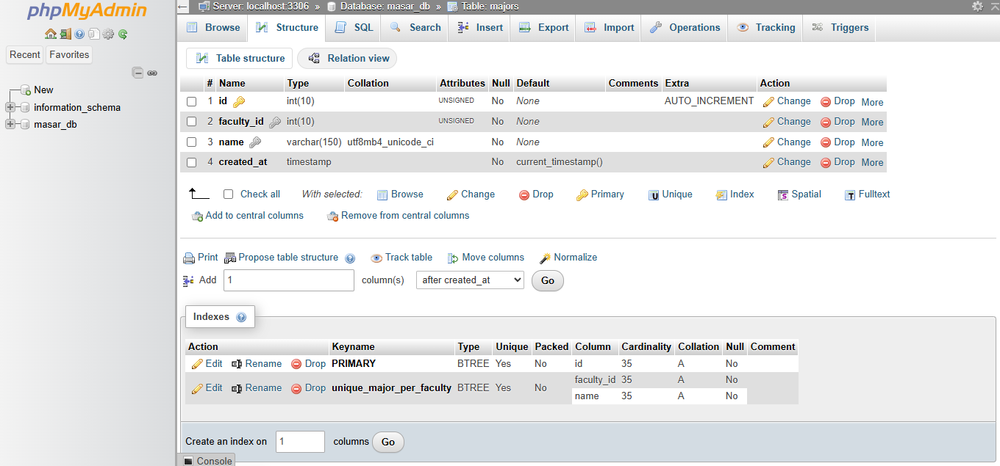

# Application Deployment Evidence

This document provides evidence of the web application deployment environment running on my Ubuntu Server.

The deployment stack combines:

* Ubuntu Server
* Apache HTTP Server
* MariaDB
* phpMyAdmin
* Tailscale
* Tailscale Funnel

The environment is used to host web applications on my home server and make selected applications remotely accessible without conventional inbound port forwarding.

---

## Deployment Architecture

The deployment environment uses two primary access paths.

### Public Application Access

```text
Internet Client
      │
      │ HTTPS
      ▼
Tailscale Funnel
      │
      ▼
Tailscale on Ubuntu Server
      │
      │ Reverse Proxy
      ▼
http://127.0.0.1:8080
      │
      ▼
Apache HTTP Server
      │
      ▼
Hosted Application
      │
      ▼
MariaDB
```

### Local Database Administration

```text
Desktop PC
     │
     │ LAN / HTTP
     ▼
Apache :8081
     │
     ▼
phpMyAdmin
     │
     ▼
MariaDB
127.0.0.1:3306
```

This setup allows the hosted application to be accessed remotely while keeping the MariaDB database service bound locally to the server.

---

# Apache HTTP Server

Apache is actively used as the web server for the deployment environment.

The current VirtualHost configuration was inspected using:

```bash
apache2ctl -S
```

Sanitized output:

```text
VirtualHost configuration:

<server-ip>:8081    phpMyAdmin VirtualHost
*:8080              Default Application VirtualHost

ServerRoot: "/etc/apache2"
Main DocumentRoot: "/var/www/html"
Main ErrorLog: "/var/log/apache2/error.log"

User:  www-data
Group: www-data
```

Apache currently provides two separate HTTP services:

| Port | Purpose                            |
| ---: | ---------------------------------- |
| 8080 | Hosted web application             |
| 8081 | phpMyAdmin database administration |

---

## Application VirtualHost

The main hosted application is served by Apache on:

```text
TCP 8080
```

The Apache listener was confirmed using:

```bash
sudo ss -tulpn
```

Sanitized output:

```text
tcp LISTEN *:8080 users:(("apache2", ...))
```

This is also the local service used as the target for Tailscale Funnel.

---

## phpMyAdmin VirtualHost

phpMyAdmin is hosted separately through Apache on:

```text
TCP 8081
```

The active configuration was detected as:

```text
/etc/apache2/sites-enabled/phpmyadmin-local.conf
```

The listening service was confirmed as:

```text
tcp LISTEN <server-ip>:8081 users:(("apache2", ...))
```

This provides browser-based database administration from devices on the local network.

---

# MariaDB

The Ubuntu Server runs **MariaDB 10.11** as its relational database service.

MariaDB listens on:

```text
127.0.0.1:3306
```

This was verified using:

```bash
sudo ss -tulpn
```

Sanitized output:

```text
tcp LISTEN 127.0.0.1:3306 users:(("mariadbd", ...))
```

Binding MariaDB to the loopback interface means the database server itself is not directly listening on every LAN interface.

Applications and management tools running on the Ubuntu server communicate with MariaDB locally.

---

## Database Access Architecture

Application access:

```text
Hosted Application
        │
        ▼
     MariaDB
  127.0.0.1:3306
```

Database administration:

```text
Desktop Browser
       │
       ▼
phpMyAdmin :8081
       │
       ▼
     MariaDB
  127.0.0.1:3306
```

This separates direct database connectivity from client access.

---

# phpMyAdmin

**phpMyAdmin** is installed as a browser-based administration interface for MariaDB.

<p align="center">
  
</p>

<p align="center">
  <em>phpMyAdmin running on the Ubuntu Server and used to inspect and administer the MariaDB database schema from a Windows client.</em>
</p>

The screenshot demonstrates a live database environment hosted on the Ubuntu server.

It shows:

* Connection to MariaDB on `localhost:3306`
* An application database
* Database tables
* Column definitions
* Data types
* Primary keys
* Unique indexes
* Schema administration through phpMyAdmin

phpMyAdmin is used from my desktop PC for tasks including:

* Viewing databases
* Inspecting table structures
* Browsing application data
* Running SQL queries
* Creating and modifying tables
* Importing and exporting data
* Managing indexes
* Troubleshooting database content

phpMyAdmin communicates with MariaDB locally on the Ubuntu server, so the MariaDB service does not need to be directly exposed to the desktop PC.

---

# Tailscale Funnel

Tailscale Funnel is used to provide external HTTPS access to the hosted application.

Current Funnel status was verified using:

```bash
tailscale funnel status
```

Sanitized output:

```text
# Funnel on:
#     - https://<server-hostname>.<tailnet>.ts.net

https://<server-hostname>.<tailnet>.ts.net (Funnel on)
|-- / proxy http://127.0.0.1:8080
```

This confirms that incoming HTTPS requests are proxied to the Apache application service running locally on:

```text
127.0.0.1:8080
```

The real Funnel hostname is intentionally excluded from the public repository.

---

## Funnel Request Flow

```text
External User
      │
      │ HTTPS :443
      ▼
Tailscale Funnel
      │
      │ Proxy
      ▼
127.0.0.1:8080
      │
      ▼
Apache
      │
      ▼
Web Application
```

This provides external application access without configuring conventional public inbound port forwarding on the ISP-provided router.

---

# Listening Services

Relevant listening ports were inspected using:

```bash
sudo ss -tulpn | grep -E ':(80|443|8080|8081|3306)\b'
```

A sanitized representation of the live environment:

```text
SERVICE        LISTEN ADDRESS        PORT
------------------------------------------------
Pi-hole FTL    0.0.0.0 / ::           80
MariaDB        127.0.0.1             3306
Tailscale      <tailscale-address>     443
Apache         *                      8080
Apache         <server-ip>            8081
```

This demonstrates that multiple services coexist on the same Ubuntu host using separate ports and network bindings.

---

## Port Allocation

| Service             | Port | Exposure                      |
| ------------------- | ---: | ----------------------------- |
| Pi-hole Web Service |   80 | Local network                 |
| Tailscale Funnel    |  443 | Tailscale-managed HTTPS       |
| Apache Application  | 8080 | Local service / Funnel target |
| phpMyAdmin          | 8081 | Local network                 |
| MariaDB             | 3306 | Loopback only                 |

This port allocation allows several independent services to operate on the same server.

---

# Multi-Service Request Flow

The resulting architecture can be represented as:

```text
                         Internet
                            │
                         HTTPS
                            │
                            ▼
                    Tailscale Funnel
                            │
                            ▼
                     127.0.0.1:8080
                            │
                            ▼
                      Apache Server
                            │
                      Web Application
                            │
                            ▼
                        MariaDB
                    127.0.0.1:3306


Windows Desktop
       │
       │ LAN
       ▼
Apache :8081
       │
       ▼
   phpMyAdmin
       │
       ▼
    MariaDB
```

---

# Service Separation

The deployment environment demonstrates several examples of service separation.

### Application Hosting

```text
Apache → TCP 8080
```

### Database Administration

```text
Apache / phpMyAdmin → TCP 8081
```

### Database Server

```text
MariaDB → 127.0.0.1:3306
```

### External HTTPS Access

```text
Tailscale Funnel → HTTPS 443 → 127.0.0.1:8080
```

Each component has a defined role within the deployment environment.

---

# Database Exposure

One important characteristic of the setup is that MariaDB is bound to:

```text
127.0.0.1
```

rather than:

```text
0.0.0.0
```

This means MariaDB is not directly exposed to LAN clients.

Database administration from the desktop is instead performed through phpMyAdmin running on the Ubuntu server.

This reduces unnecessary direct exposure of the database service while still allowing convenient browser-based administration.

---

# Apache and Pi-hole Port Coexistence

The server currently runs both Apache and Pi-hole.

Inspection of listening ports shows:

```text
Pi-hole FTL → TCP 80
Apache      → TCP 8080 / 8081
```

Because the services use different listening ports, they can coexist on the same Ubuntu host without competing for the same TCP socket.

---

# Apache Configuration Observation

Running:

```bash
apache2ctl -S
```

also produced the following warning:

```text
Could not reliably determine the server's fully qualified domain name
```

Apache continues to operate normally, but this indicates that a global `ServerName` directive has not been explicitly configured.

This has been identified as a future configuration cleanup task.

Documenting issues such as this is part of the lab process: identifying configuration warnings, understanding their cause, and improving the environment over time.

---

# Verified Deployment Components

| Component          | Status        | Role                                  |
| ------------------ | ------------- | ------------------------------------- |
| Ubuntu Server      | Running       | Deployment host                       |
| Apache HTTP Server | Active        | Web application hosting               |
| Apache :8080       | Listening     | Application endpoint                  |
| Apache :8081       | Listening     | phpMyAdmin endpoint                   |
| MariaDB 10.11      | Active        | Application database                  |
| MariaDB :3306      | Loopback only | Local database connectivity           |
| phpMyAdmin         | Accessible    | Browser-based database administration |
| Tailscale          | Active        | Remote networking                     |
| Tailscale Funnel   | Enabled       | External HTTPS application access     |

---

# Commands Used for Verification

## Apache VirtualHosts

```bash
apache2ctl -S
```

## Listening Ports

```bash
sudo ss -tulpn
```

## Relevant Web and Database Ports

```bash
sudo ss -tulpn | grep -E ':(80|443|8080|8081|3306)\b'
```

## MariaDB

```bash
systemctl status mariadb
```

## Apache

```bash
systemctl status apache2
```

## Tailscale Funnel

```bash
tailscale funnel status
```

---

# Troubleshooting Experience

Building and maintaining this environment required understanding the interaction between:

* Web server ports
* Local and external network interfaces
* Apache VirtualHosts
* Reverse proxy behavior
* Database bindings
* VPN connectivity
* HTTPS publishing
* Multiple services sharing the same Linux host

Useful troubleshooting tools included:

```bash
apache2ctl -S
```

```bash
ss -tulpn
```

```bash
systemctl status <service>
```

```bash
journalctl -u <service>
```

```bash
curl <address>
```

```bash
ip addr
```

```bash
ip route
```

These tools were used to verify which processes were listening, how requests were routed, and where problems occurred within the deployment stack.

---

# Skills Demonstrated

This deployment environment provides hands-on experience with:

* Ubuntu Server
* Linux server administration
* Apache HTTP Server
* Apache VirtualHosts
* MariaDB
* phpMyAdmin
* SQL database administration
* Application deployment
* TCP ports and listening sockets
* Loopback interfaces
* Service separation
* Reverse proxying
* HTTPS
* Tailscale
* Tailscale Funnel
* Remote service access
* Database administration
* Client/server architecture
* Linux troubleshooting
* Multi-service hosting

---

# Privacy and Sanitization

Because this repository is public, sensitive infrastructure information is intentionally excluded.

The documentation does not publish:

* Internal IP addresses
* Tailscale IP addresses
* Funnel hostname
* Database credentials
* Database users
* Authentication tokens
* Passwords
* Public IP addresses
* Application secrets
* API keys
* Private user data

Configuration output shown in this document has been sanitized before publication.

---

## Summary

The Ubuntu Server provides a complete self-hosted application deployment environment.

The live configuration demonstrates the following external application workflow:

```text
Internet
   ↓
HTTPS
   ↓
Tailscale Funnel
   ↓
Apache
   ↓
Hosted Application
   ↓
MariaDB
```

Local database administration follows:

```text
Desktop PC
   ↓
phpMyAdmin
   ↓
MariaDB
```

Together, these components demonstrate practical experience deploying and administering a web application stack on Linux while combining web hosting, relational databases, remote connectivity, service separation, and infrastructure troubleshooting.
