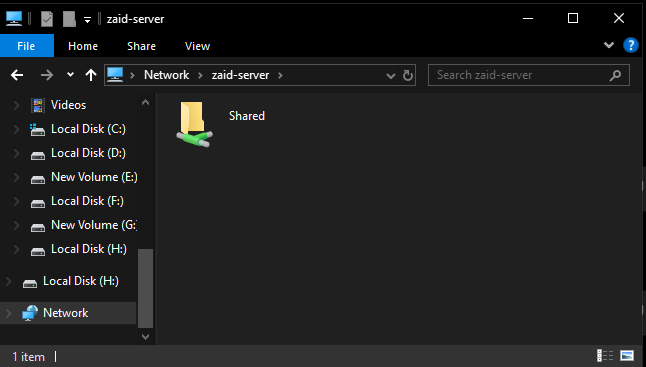

# Samba / SMB File Sharing Evidence

This document provides evidence of the network file-sharing environment running between my Ubuntu Server and Windows desktop.

The Ubuntu server uses **Samba** to provide SMB-based shared storage to Windows clients on the local network.

---

## Windows Client Access

<p align="center">
  
</p>

<p align="center">
  <em>Windows File Explorer discovering the Ubuntu Server by hostname and displaying the configured Shared network folder.</em>
</p>

The server can be accessed from Windows using its hostname:

```text
\\zaid-server
```

The Windows client successfully discovers the server and displays the configured:

```text
Shared
```

network share.

Using the hostname instead of a direct IP address also allows the server to be accessed without manually entering its private network address.

---

## Architecture

```text
Windows Desktop
      │
      │ SMB
      ▼
  zaid-server
 Ubuntu Server
      │
      ▼
 Samba / smbd
      │
      ▼
 /srv/samba/share
```

The Ubuntu server acts as the file server while the Windows desktop operates as an SMB client.

---

## Samba Service

The primary Samba SMB daemon is actively running on the Ubuntu server.

Command:

```bash
systemctl status smbd --no-pager
```

Verified status:

```text
smbd.service - Samba SMB Daemon

Loaded: loaded
Active: active (running)

Status: "smbd: ready to serve connections..."
```

The related NetBIOS service is also running:

```text
nmbd.service    active running
```

These services provide Windows-compatible file-sharing functionality from the Linux server.

---

## Configuration Validation

The active Samba configuration was inspected using:

```bash
testparm -s
```

`testparm` successfully loaded the Samba configuration and confirmed that the server is operating as a standalone Samba server.

Relevant sanitized configuration:

```ini
[global]
    server min protocol = SMB2
    server role = standalone server
    server string = %h server (Samba, Ubuntu)

[Shared]
    path = /srv/samba/share
    read only = No
    valid users = zaid
    create mask = 0664
    directory mask = 0775
```

---

## Share Configuration

The configured share is:

```text
Share Name: Shared
Path:       /srv/samba/share
Access:     Read / Write
```

Access is restricted using:

```ini
valid users = zaid
```

rather than making the share openly writable to all network clients.

---

## File Permissions

The share uses separate permission masks for files and directories.

### Files

```text
0664
```

This provides:

```text
Owner:  read + write
Group:  read + write
Others: read
```

### Directories

```text
0775
```

This provides:

```text
Owner:  read + write + execute
Group:  read + write + execute
Others: read + execute
```

This configuration allows the share to remain writable while maintaining predictable Linux filesystem permissions.

---

## SMB Protocol

The Samba configuration specifies:

```ini
server min protocol = SMB2
```

This prevents the server from falling back to the obsolete SMB1 protocol when acting as an SMB server.

Windows clients therefore communicate with the server using SMB2 or newer.

---

## Client Connection

An active Windows client connection can be inspected from the Ubuntu server using:

```bash
sudo smbstatus --shares
```

During network browsing, Samba reported an active IPC session from a Windows client.

Example sanitized output:

```text
Service      pid     Machine     Connected at  Encryption   Signing
------------------------------------------------------------------------------
IPC$         8313    <client-ip> <timestamp>   -            -
IPC$         8359    <client-ip> <timestamp>   -            -
Shared       8359    <client-ip> <timestamp>   -            -

```
The Shared entry confirms an active Windows client session connected to the configured Samba share.

`IPC$` is an internal Samba share used for communication, browsing, and service discovery between SMB clients and the server.

Opening files within the configured `Shared` share can also create an active share session visible through `smbstatus`.

---

## Windows Access Flow

The practical access flow is:

```text
Windows File Explorer
        │
        ▼
Network
        │
        ▼
zaid-server
        │
        ▼
Shared
        │
        ▼
Linux Filesystem
/srv/samba/share
```

This allows files stored on the Linux server to be accessed directly from Windows without manually transferring them through removable storage or external services.

---

## Use Cases

The Samba environment is used for:

* File transfers between Windows and Linux
* Centralized local storage
* Accessing Linux-hosted files through Windows File Explorer
* Sharing files across the LAN
* Testing Linux filesystem permissions
* Practicing cross-platform network services

---

## Administration

Useful commands for managing and troubleshooting Samba include:

### Service Status

```bash
systemctl status smbd
```

### Restart Samba

```bash
sudo systemctl restart smbd
```

### Validate Configuration

```bash
testparm -s
```

### Inspect Active Connections

```bash
sudo smbstatus
```

### Inspect Active Shares

```bash
sudo smbstatus --shares
```

### Inspect Listening Services

```bash
sudo ss -tulpn
```

---

## Verified Components

| Component                    | Status     |
| ---------------------------- | ---------- |
| Ubuntu Server                | Running    |
| Samba SMB Daemon             | Active     |
| Samba NMB Daemon             | Active     |
| `Shared` SMB Share           | Configured |
| Windows Discovery            | Working    |
| Hostname Access              | Working    |
| Windows File Explorer Access | Working    |
| Read / Write Share           | Configured |
| SMB2 Minimum Protocol        | Configured |

---

## Security Notes

The public repository intentionally excludes:

* Private IP addresses
* Samba passwords
* Authentication credentials
* Personal files
* Sensitive directory contents
* Private network information

Only the configuration required to demonstrate the file-sharing environment is documented.

---

## Configuration Review

While validating the Samba configuration, `testparm` also reported several legacy or deprecated configuration warnings.

These include settings related to older NTLM compatibility and legacy Samba tuning options.

These settings are not required to demonstrate the SMB share and will be reviewed as part of future server hardening.

This is also part of the purpose of the home lab: identifying older configuration choices, understanding their impact, and improving the environment over time.

---

## Skills Demonstrated

This setup provides hands-on experience with:

* Samba
* SMB
* Linux file services
* Windows/Linux interoperability
* Network shares
* Hostname-based access
* Linux filesystem permissions
* Authentication
* SMB configuration
* Service management
* Client/server troubleshooting
* Configuration validation

---

## Summary

The Ubuntu server successfully provides SMB-based network storage to Windows clients using Samba.

The environment demonstrates a complete client/server file-sharing workflow:

```text
Windows Client → SMB → Samba → Linux Filesystem
```

The service is actively used on the local network and provides practical experience administering a cross-platform Linux file server.
