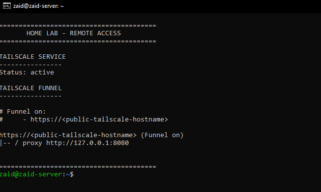

# Tailscale Remote Access Evidence

This document provides evidence of the remote networking environment configured on my Ubuntu Server using **Tailscale**.

The server is used to provide:

* Secure remote access
* Private device-to-device connectivity
* Access to services hosted inside the home network
* Subnet routing to the home LAN
* HTTPS application publishing using Tailscale Funnel

This allows remote devices to reach selected home-lab resources without relying entirely on conventional inbound port forwarding.

---

## Live Remote Access Status

<p align="center">
  
</p>

<p align="center">
  <em>Live Tailscale service and Funnel status from the Ubuntu Server with public addressing information sanitized.</em>
</p>

The screenshot confirms that:

* The Tailscale daemon is active
* Tailscale Funnel is enabled
* HTTPS traffic is forwarded to a locally hosted application
* The Funnel target is `127.0.0.1:8080`

---

# Tailscale Service

Tailscale runs as a systemd service on the Ubuntu Server.

Command:

```bash
systemctl status tailscaled --no-pager
```

Sanitized status:

```text
tailscaled.service - Tailscale node agent

Loaded: loaded
Active: active (running)
Status: Connected
```

The service is configured to start automatically with the system.

---

## Remote Connectivity

Tailscale creates an encrypted private network between authorized devices.

The environment includes devices such as:

```text
Remote Device
     │
     ▼
Tailscale Network
     │
     ▼
Ubuntu Server
```

This connectivity is used for:

* Remote SSH administration
* Accessing hosted applications
* Accessing services inside the home lab
* Game server connectivity
* Network troubleshooting
* Remote testing

Sensitive Tailscale addresses and account information are intentionally excluded from this repository.

---

# Subnet Routing

The Ubuntu Server is configured to advertise the home LAN through Tailscale.

The current advertised route was inspected using:

```bash
tailscale debug prefs
```

Relevant sanitized configuration:

```text
"AdvertiseRoutes": [
    "<home-lan-subnet>"
]
```

The configured route represents the private home network.

This makes the Ubuntu server function as a **Tailscale Subnet Router**, providing a path between authorized Tailscale devices and resources located on the home LAN.

---

## Subnet Router Architecture

```text
Remote Tailscale Device
          │
          │ Encrypted Tailscale Network
          ▼
     Ubuntu Server
     Subnet Router
          │
          │ Home LAN
          ▼
   Internal Network
          │
     ┌────┼──────────┐
     │    │          │
    APs  Servers   Other LAN
                   Devices
```

Instead of requiring Tailscale to be installed on every LAN device, subnet routing can allow remote authorized clients to reach devices behind the Ubuntu server through an advertised network route.

---

## IP Forwarding

Subnet routing requires packet forwarding on the Linux host.

The forwarding configuration was verified using:

```bash
sysctl net.ipv4.ip_forward net.ipv6.conf.all.forwarding
```

Live output:

```text
net.ipv4.ip_forward = 1
net.ipv6.conf.all.forwarding = 0
```

IPv4 forwarding is enabled, which supports routing traffic between the Tailscale interface and the IPv4 home LAN.

IPv6 forwarding is currently disabled.

---

# Tailscale Funnel

The server also uses **Tailscale Funnel** to provide external HTTPS access to a hosted application.

Funnel status was verified using:

```bash
tailscale funnel status
```

Sanitized output:

```text
# Funnel on:
#     - https://<public-tailscale-hostname>

https://<public-tailscale-hostname> (Funnel on)
|-- / proxy http://127.0.0.1:8080
```

This confirms that Tailscale Funnel accepts HTTPS requests and proxies them to a local application running on:

```text
127.0.0.1:8080
```

---

## Funnel Architecture

```text
Internet Client
      │
      │ HTTPS
      ▼
Tailscale Funnel
      │
      │ Secure Proxy
      ▼
Ubuntu Server
      │
      ▼
127.0.0.1:8080
      │
      ▼
Apache
      │
      ▼
Hosted Application
```

This allows a selected application to be reachable externally without configuring conventional inbound port forwarding on the ISP-provided router.

---

# Private Access vs Public Publishing

The Tailscale environment performs two different roles.

## Private Remote Access

Tailscale's private network is used for communication between authorized devices.

```text
Authorized Device
      │
      ▼
Private Tailscale Network
      │
      ▼
Ubuntu Server / Home Lab
```

Examples include:

* SSH
* Game server connectivity
* Infrastructure administration
* Access to internal services

---

## Public Application Access

Tailscale Funnel provides public HTTPS access to a selected application.

```text
Internet
   │
   ▼
HTTPS
   │
   ▼
Tailscale Funnel
   │
   ▼
Apache :8080
   │
   ▼
Application
```

Only the selected Funnel endpoint is publicly published.

---

# Remote SSH Administration

SSH is one of the primary services accessed through the remote network.

Typical architecture:

```text
Remote Laptop
      │
      ▼
Tailscale
      │
      ▼
Ubuntu Server
      │
      ▼
SSH
```

This provides secure server administration without requiring SSH to be directly exposed through conventional router port forwarding.

Tasks performed remotely include:

* Service management
* Configuration changes
* Log inspection
* Application deployment
* Network troubleshooting
* Database administration
* Game server administration

---

# Application Deployment

Tailscale Funnel is also part of the application deployment environment.

The complete request path is:

```text
External User
      │
      ▼
HTTPS
      │
      ▼
Tailscale Funnel
      │
      ▼
127.0.0.1:8080
      │
      ▼
Apache HTTP Server
      │
      ▼
Hosted Application
      │
      ▼
MariaDB
```

This setup allows an application running on home infrastructure to be demonstrated and tested remotely.

---

# Networking Concepts Demonstrated

The Tailscale deployment provides hands-on experience with several networking concepts.

## Overlay Networking

Tailscale creates an encrypted overlay network across devices located on different physical networks.

## Subnet Routing

The Ubuntu Server advertises the home LAN to authorized Tailscale devices.

## IP Forwarding

Linux IPv4 forwarding allows routed traffic to move between network interfaces.

## Reverse Proxying

Tailscale Funnel proxies HTTPS traffic to the locally hosted Apache service.

## Loopback Networking

The Funnel backend uses:

```text
127.0.0.1:8080
```

to access the application locally on the Ubuntu Server.

## Remote Administration

SSH traffic can travel through the private Tailscale network instead of being directly exposed to the public Internet.

---

# Verified Components

| Component               | Status           | Purpose                      |
| ----------------------- | ---------------- | ---------------------------- |
| Tailscale daemon        | Active           | Private overlay networking   |
| Ubuntu Server           | Connected        | Remote-access host           |
| IPv4 forwarding         | Enabled          | Subnet routing               |
| LAN route advertisement | Configured       | Home-network access          |
| Tailscale Subnet Router | Configured       | Route remote devices to LAN  |
| Tailscale Funnel        | Enabled          | HTTPS application publishing |
| Funnel backend          | `127.0.0.1:8080` | Apache application           |
| SSH                     | Active           | Remote administration        |

---

# Exit Node Status

The Ubuntu Server is **not currently configured as a Tailscale Exit Node**.

The current configuration advertises the private home LAN subnet rather than default Internet routes.

A Tailscale Exit Node would normally advertise routes covering general Internet traffic, while the current server configuration is focused on **subnet routing to the home network**.

Documenting this distinction is important because subnet routing and exit-node routing serve different networking purposes.

---

# Commands Used for Verification

## Tailscale Service

```bash
systemctl status tailscaled --no-pager
```

## Funnel Status

```bash
tailscale funnel status
```

## Advertised Routes

```bash
tailscale debug prefs | sed -n '/"AdvertiseRoutes"/,/]/p'
```

## IP Forwarding

```bash
sysctl net.ipv4.ip_forward net.ipv6.conf.all.forwarding
```

## General Tailscale Status

```bash
tailscale status
```

---

# Privacy and Sanitization

The public repository intentionally excludes:

* Tailscale IPv4 addresses
* Tailscale IPv6 addresses
* Tailscale account email
* Public Funnel hostname
* Authentication keys
* Device authentication information
* Internal IP addresses
* Public IP addresses
* Private credentials

Only information necessary to demonstrate the technical configuration is published.

---

# Skills Demonstrated

This environment provides practical experience with:

* Tailscale
* Overlay networking
* VPN-style private networking
* Linux routing
* IPv4 forwarding
* Subnet routing
* Route advertisement
* Remote administration
* SSH
* HTTPS
* Reverse proxying
* Tailscale Funnel
* Loopback interfaces
* Remote application deployment
* Network troubleshooting

---

## Summary

The Ubuntu Server functions as a central remote-access gateway for the home lab.

Its Tailscale configuration provides two major capabilities:

```text
1. Private Remote Networking
Remote Device
     ↓
Tailscale
     ↓
Ubuntu Server
     ↓
Home LAN
```

and:

```text
2. Public Application Publishing
Internet
   ↓
HTTPS
   ↓
Tailscale Funnel
   ↓
Apache :8080
   ↓
Hosted Application
```

The server is configured as a **Tailscale Subnet Router**, with IPv4 forwarding enabled to support routed access to the home LAN.

Together, these features provide hands-on experience with secure remote access, Linux routing, overlay networking, subnet routing, and HTTPS application publishing.
